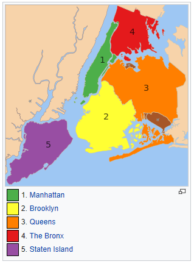
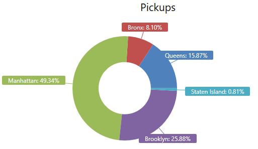
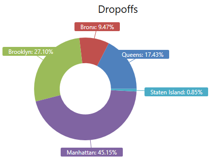
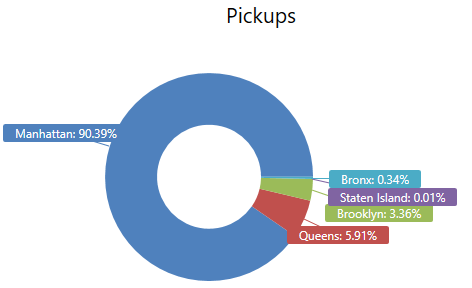
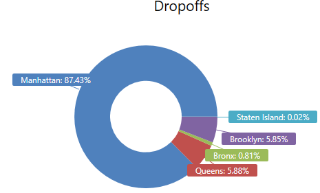

# Analyzing 2 billion New York city taxi rides in Kusto

*Last modified: 02/10/2019*

The [NYC Taxi & Limousine Commission](https://www1.nyc.gov/site/tlc/index.page){:target="_blank"} makes
historical data about taxi trips and for-hire-vehicle trips (such as [Uber](analyzing-uber-rides-history.md){:target="_blank"},
Lyft, Juno, Via, etc.) [available](https://www1.nyc.gov/site/tlc/about/tlc-trip-record-data.page){:target="_blank"}
for anyone to download and analyze. These records capture pick-up and drop-off dates/times, pick-up and drop-off locations,
trip distances, itemized fares, rate types, payment types, and driver-reported passenger counts.

<p align="center">
  
</p>

I've detailed how simple and efficient it is to ingest this data set into **Kusto** in [another post](ingesting-nyc-taxi-rides.md).

A quick search on Google will show you many people have taken a 1.x Billion taxi rides data set for a ride, with the intention of:
* Comparing query performance of multiple data platforms with different topologies.
* Gaining insights from the data about topics like rush hour traffic, popular work hours for investment bankers,
  how [Uber](analyzing-uber-rides-history.md){:target="_blank"}, Lyft and their competitors are changing the landscape for taxis, etc.
    * Here's [an example](http://toddwschneider.com/posts/analyzing-1-1-billion-nyc-taxi-and-uber-trips-with-a-vengeance/){:target="_blank"}
      by [Todd W. Schneider](https://github.com/toddwschneider){:target="_blank"}.

In this post, I will do some of both.

* TOC
{:toc}

## Query Performance

### Setup

For the purpose of this evaluation, I used:

1. An **Kusto** cluster with `D14_v2` nodes, which I've scaled gradually from 2 to 4, 6 and finally - 8 nodes.
    * *Note*: The evaluation detailed in this post ran with `V2` of the Kusto Engine. A new and improved `V3` became generally available during March 2021.
    * These VMs have 16 vCPUs and 112GB of RAM.
        * I later on scaled down the cluster to 2 `D12_v2` (4 vCPUs, 28GB of RAM) nodes, and repeated the same query test run.
    * I created this cluster using the [Azure Portal](https://docs.microsoft.com/en-us/azure/data-explorer/create-cluster-database-portal){:target="_blank"}
    * In this cluster, I [created a database](https://docs.microsoft.com/en-us/azure/data-explorer/create-cluster-database-portal#create-a-database){:target="_blank"}
      named `TaxiRides`.
    * In this database, I created the `Trips` table, and ingested the data into it, as I've detailed in a [previous post](ingesting-nyc-taxi-rides.md).
    * I have applied no tweaks or tricks neither during ingestion nor during queries - this is a fully managed service which takes care of everything for you.
    * The `Trips` table includes **1,547,471,776** records.

        ```
        Trips
        | count
        ```
    
        |Count        |
        |-------------|
        |1,547,471,776|


2. Four basic aggregation queries (detailed [below](#results))
    * These are based on the queries which were [used by Mark Litwintschik](https://tech.marksblogg.com/benchmarks.html){:target="_blank"}
       in his series of posts about 1.1 billion taxi rides with other technologies.
    * I've used the translation of these from SQL to Kusto's query language
      (even though you can [run SQL queries against Kusto](https://docs.microsoft.com/en-us/azure/kusto/api/tds/){:target="_blank"}).

3. A simple application, written using
[Kusto's .NET client library](https://docs.microsoft.com/en-us/azure/kusto/api/netfx/about-kusto-data){:target="_blank"},
in which I replayed these queries over and over again, so that I can look at the percentiles of the query execution times.
    - Needless to say, that C# is just one of the languages in which the 
      [client libraries](https://docs.microsoft.com/en-us/azure/kusto/api/){:target="_blank"} are available.

### Cost 💲

If you're interested in the cost per hour for the different cluster sizes, check out the pricing details using the
[Azure pricing calculator](https://azure.microsoft.com/en-us/pricing/calculator/){:target="_blank"}, or head over
directly to the [Cost estimator](https://dataexplorer.azure.com/AzureDataExplorerCostEstimator.html){:target="_blank"}.

### Results

**Notes:**

* If you're comparing these to other runs available online, make sure you're doing 🍏🍏-to-🍏🍏 comparison,
  taking into account the size of the data set, the resources, and their cost.
* These results are accurate as of February 2019. In the competitive landscape of BigData platforms and technologies,
  I would expect these to get even better as time goes by.


I used [.show queries](https://docs.microsoft.com/en-us/azure/kusto/management/queries){:target="_blank"} to capture, per query:
* The number of executions.
* The minimum execution time.
* The 50th and 95th percentiles of the execution time.

I repeated this for each of the 5 cluster sizes, and these are the results:

#### Q 1

```
Trips
| summarize count()
         by cab_type
```

| QueryId | ClusterSize | Runs  | Minimum      | P50          | P95          |
|---------|-------------|-------|--------------|--------------|--------------|
| Q 1     | 2 x D12v2   | 120   | 00:00:05.188 | 00:00:05.313 | 00:00:05.531 |
| Q 1     | 2 x D14v2   | 200   | 00:00:01.797 | 00:00:01.828 | 00:00:01.906 |
| Q 1     | 4 x D14v2   | 240   | 00:00:01.406 | 00:00:01.453 | 00:00:01.563 |
| Q 1     | 6 x D14v2   | 230   | 00:00:01.375 | 00:00:01.438 | 00:00:01.547 |
| Q 1     | 8 x D14v2   | 260   | 00:00:01.172 | 00:00:01.203 | 00:00:01.250 |

#### Q 2

```
Trips 
| summarize avg(total_amount)
         by passenger_count
```

| QueryId | ClusterSize | Runs  | Minimum      | P50          | P95          |
|---------|-------------|-------|--------------|--------------|--------------|
| Q 2     | 2 x D12v2   | 100   | 00:00:04.484 | 00:00:04.596 | 00:00:04.766 |
| Q 2     | 2 x D14v2   | 200   | 00:00:01.531 | 00:00:01.564 | 00:00:01.687 |
| Q 2     | 4 x D14v2   | 233   | 00:00:01.203 | 00:00:01.250 | 00:00:01.344 |
| Q 2     | 6 x D14v2   | 230   | 00:00:01.187 | 00:00:01.250 | 00:00:01.547 |
| Q 2     | 8 x D14v2   | 260   | 00:00:01.031 | 00:00:01.062 | 00:00:01.219 |

#### Q 3

```
Trips 
| summarize count()
         by passenger_count,
            year = startofyear(pickup_datetime)
```

| QueryId | ClusterSize | Runs  | Minimum      | P50          | P95          |
|---------|-------------|-------|--------------|--------------|--------------|
| Q 3     | 2 x D12v2   | 97    | 00:00:10.016 | 00:00:10.239 | 00:00:10.781 |
| Q 3     | 2 x D14v2   | 198   | 00:00:03.359 | 00:00:03.422 | 00:00:05.281 |
| Q 3     | 4 x D14v2   | 230   | 00:00:02.656 | 00:00:02.703 | 00:00:02.859 |
| Q 3     | 6 x D14v2   | 237   | 00:00:02.609 | 00:00:02.687 | 00:00:02.860 |
| Q 3     | 8 x D14v2   | 258   | 00:00:02.203 | 00:00:02.250 | 00:00:02.953 |

#### Q 4

```
Trips 
| summarize trips = count()
         by passenger_count, 
            year = startofyear(pickup_datetime),
            distance = round(trip_distance)
| order by year asc,
           trips desc
```

| QueryId | ClusterSize | Runs  | Minimum      | P50          |  P95          |
|---------|-------------|-------|--------------|--------------|---------------|
| Q 4     | 2 x D12v2   | 60    | 00:00:15.208 | 00:00:15.454 |  00:00:15.721 |
| Q 4     | 2 x D14v2   | 180   | 00:00:05.125 | 00:00:05.219 |  00:00:06.375 |
| Q 4     | 4 x D14v2   | 230   | 00:00:04.079 | 00:00:04.156 |  00:00:04.391 |
| Q 4     | 6 x D14v2   | 235   | 00:00:04.025 | 00:00:04.109 |  00:00:04.391 |
| Q 4     | 8 x D14v2   | 250   | 00:00:03.562 | 00:00:03.625 |  00:00:03.781 |

💨 *I'd say that's pretty fast, huh?* 💨

## Exploring and Analyzing the data

For the purpose of this exploration, I've used an
[Azure Notebook](https://notebooks.azure.com/){:target="_blank"}
with the [KQL magic](https://docs.microsoft.com/en-us/azure/data-explorer/kqlmagic){:target="_blank"} library.
You could use a [Jupyter notebook](https://jupyter.org/){:target="_blank"} in a similar manner.

> **Caveats**
>
> * The following (suggestive) insights are based only on the available data, and should not be taken as any kind
>   of official or meaningful research.
>
> * I have no official education or knowledge beyond what's available online about NYC
>   transportation, Taxi companies and operators, and ride-hailing or ride-sharing companies.
>
> * The main objective in publishing these is to show the rich query and analytical capabilities
>   of the Kusto query language, and obviously - have lots of fun in the process of doing so 😊

**Note:** All the queries shown below ran against a cluster with 2 X `D14_v2` nodes, and completed
in a matter of seconds.

### Taxis vs. FHVs

Yellow cabs pretty much dominated the scene up until a few years ago.
In the summer of 2013, Green taxis (AKA Boro taxis) started to appear, contributed
to an overall rise in the use of taxis, but also took some of the 'market share' from the
yellow ones:


Later on, FHVs grew increasingly popular, posing an even greater competitor than the Green Taxis:


Uber and Lyft's growth seems to be hiking up nicely since 2015, and a few smaller players have also entered NYC in recent years:


Tying them all together, show Yellow cabs and Green taxis are continuing their decline, and Uber growing at a faster pace than all other FHVs, with Lyft coming in second:


Here's the query I used to render this time chart:

```
%%kql
union 
(
    Trips
    | where pickup_datetime between(datetime(2009-01-01) .. datetime(2018-07-01))
    | summarize count() by Type = cab_type, bin(pickup_datetime, 7d)
),(
    MemberBase // Small dimension table; Data taken from: http://www.nybcf.org/members/ 
    | extend Name = case(Name has "Uber" or Name has "Grun" or Name has "Unter", "Uber",
                         Base in("B02510", "B02844"), "Lyft",
                         Name has "(Via)", "Via",
                         Name has "Juno", "Juno",
                         Name has "(Gett)", "Gett",
                         Name)
    | join hint.strategy = broadcast 
    (
        FHV_Trips
        | where pickup_datetime between(datetime(2009-01-01) .. datetime(2018-07-01))
    ) on $left.Base == $right.Dispatching_base_num 
    | summarize count() by Type = Name, bin(pickup_datetime, 7d)
    | where count_ > 25000 // filtering out the smaller players
)
| render timechart
```

### FHVs: private or shared?

The `Shared` flag started to appear in the data only since July 2017, so I'll be focusing on a
1 year period for this section.

There are 3 players in the shared rides area: Uber, Lyft and Via.
While all 3 offer both private and shared options, Via's shared option is more popular than its
private one, which makes sense as it is a *ride-sharing* company:


While for Lyft and Uber, it's the other way around, with Uber's private service far ahead:


BTW, this query runs in a daily resolution, so you can easily identify the seasonality that
shows weekends are usually lower in demand than weekdays.

This is the query I used for the charts above:

```
%%kql
MemberBase // Small dimension table; Data taken from: http://www.nybcf.org/members/ 
| extend Name = case(Name has "Uber" or Name has "Grun" or Name has "Unter", "Uber",
                     Base in("B02510", "B02844"), "Lyft",
                     Name has "(Via)", "Via",
                     Name has "Juno", "Juno",
                     Name has "(Gett)", "Gett",
                     Name)
| join hint.strategy = broadcast 
(
    FHV_Trips
    | where pickup_datetime between(datetime(2017-07-01) .. datetime(2018-07-01))
) on $left.Base == $right.Dispatching_base_num 
| summarize count() by Name, Shared = Shared_Ride_Flag, bin(pickup_datetime, 1d)
| where count_ > 1750 // filtering out the smaller players
| extend Name = iff(Shared == true, strcat(Name, "_Shared"), Name)
| render timechart 
```

Overall, it does seem that shared rides are on the rise, but are still behind private
ones, which are rising as well:

```
%%kql
FHV_Trips
| where pickup_datetime between(datetime(2017-07-01) .. datetime(2018-07-01))
| make-series RideCount = count() on pickup_datetime from datetime(2017-07-01) to datetime(2018-07-01) step 1d by Shared = Shared_Ride_Flag
| extend series_fit_2lines(RideCount)
| mv-expand RideCount to typeof(long), pickup_datetime to typeof(datetime), series_fit_2lines_RideCount_line_fit to typeof(long)
| project pickup_datetime, Shared, RideCount, series_fit_2lines_RideCount_line_fit
| render timechart 
```


### [Boroughs of New York City](https://en.wikipedia.org/wiki/Boroughs_of_New_York_City){:target="_blank"}

New York City encompasses five county-level administrative divisions called boroughs: The Bronx, Brooklyn, Manhattan, Queens, and Staten Island.



Let's see where FHV rides are being used according to their pickup and dropoff locations, and how it compares
to Yellow cabs and Green taxis:

#### FHV pickups & dropoffs

```
%%kql
TaxiZoneLookup // Small dimension table; Data taken from: https://raw.githubusercontent.com/fivethirtyeight/uber-tlc-foil-response/master/uber-trip-data/taxi-zone-lookup.csv
| join hint.strategy = broadcast 
(
    FHV_Trips
    | where isnotempty(Pickup_location_ID) // for some records, this data point is missing in the original data set            
    | summarize count() by Pickup_location_ID
) on $left.LocationId == $right.Pickup_location_ID
| where Borough !in ("Unknown", "EWR")
| summarize sum(count_ ) by Borough
| render piechart with(title = "Pickups")
```

 

#### Yellow / Green pickups and dropoffs

```
%%kql
Trips
| where isnotempty(dropoff_boroname) // for some records, this data point is missing in the original data set
| summarize count() by dropoff_boroname 
| where dropoff_boroname !in ("New Jersey")
| render piechart with(title = "Dropoffs")
```

 

### Taxi: Cash or card?

As one would expect, there's been a decline in the use of cash in favor of using a credit card.
Both are declining as this is data for Yellow / Green taxis, which are both getting hit by FHVs:

```
%%kql
datatable(code:string, meaning:string) [
'1', "Credit card", 
'2', "Cash",
'Cas', "Cash",
'CAS', "Cash",
'Cash', "Cash",
'CASH', "Cash",
'CRD', "Credit card",
'Cre', "Credit card",
'CRE', "Credit card",
'Credit', "Credit card",
'CREDIT', "Credit card",
'CSH', "Cash",
]
| join hint.strategy = broadcast 
(
    Trips
    | where pickup_datetime between(datetime(2009-01-01) .. datetime(2018-07-01))
) on $left.code == $right.payment_type
| summarize count() by payment_type = meaning, bin(pickup_datetime, 7d)
| render timechart 
```


BTW, you can also see that while the cost-per-minute has stayed roughly flat over the last few years,
the cost-per-minute has just slightly increased, for Yellow & Green taxi rides:

```
%%kql
Trips
| where pickup_datetime between(datetime(2014-01-01) .. datetime(2018-07-01))
| extend dollars_per_mile = 1.0 * total_amount / trip_distance,
         dollars_per_minute = 1.0 * total_amount / ((dropoff_datetime - pickup_datetime) / 1m)
| summarize percentile(dollars_per_mile, 50),
            percentile(dollars_per_minute, 50)
         by cab_type, bin(pickup_datetime, 7d)
| render timechart 
```


### Traffic

You could try to guess in which Borough Yellow / Green taxi's ride the slowest, but could you explain
why the speed in Staten Island significantly decreased in 2016?

```
%%kql
Trips
| where pickup_datetime between(datetime(2014-01-01) .. datetime(2018-07-01))
| where isnotempty(pickup_boroname) // some records in the original data set do not have this data point
| where pickup_boroname != "New Jersey"
| extend miles_per_hour = 1.0 * trip_distance / ((dropoff_datetime - pickup_datetime) / 1h)
| summarize percentile(miles_per_hour, 50)
         by pickup_boroname, bin(pickup_datetime, 7d)
| render timechart  
```


*(Got suggestions for more interesting queries? Let me know and I'll update the post based on your feedback)*

---

