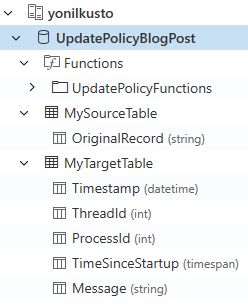
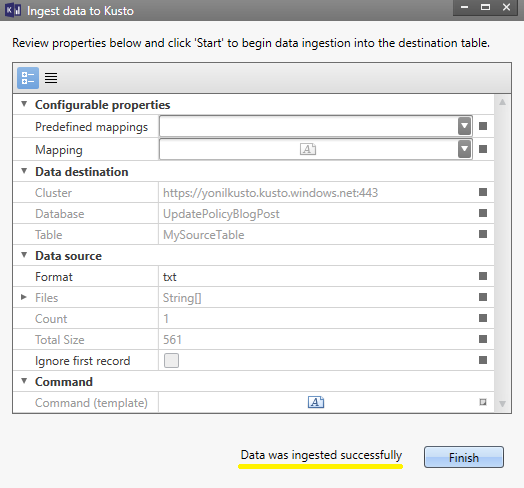
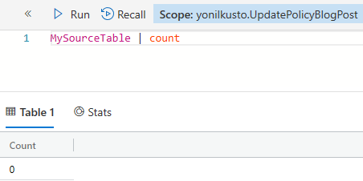
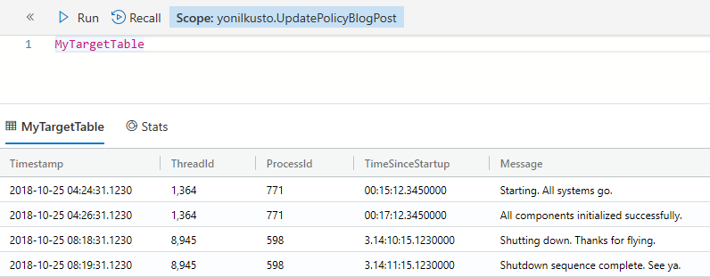

# Update policies for ELT in Kusto (Azure Data Explorer)

*Last modified: 11/08/2018*

Kusto (Azure Data Explorer) is super fast and efficient in getting your data ingested (, and then queried).

It's usually recommended that your data is formatted to begin with, in either of the [supported
data formats](https://docs.microsoft.com/en-us/azure/kusto/management/data-ingestion/#supported-data-formats){:target="_blank"},
with [CSV](https://tools.ietf.org/html/rfc4180){:target="_blank"} being the superior choice, in terms of both the clear definition of the format, as well the best performance at ingestion time.

In some cases, however, you have no control over the format of the data, but you still want to store it an
efficient manner. In other cases, you may want to enrich the data as it gets ingested into Kusto (e.g. by joining the new records with a static dimension table which is already in your Kusto database). For both of these cases, using an [update policy](https://docs.microsoft.com/en-us/azure/kusto/management/updatepolicy){:target="_blank"} is a very common and powerful practice.

In this post, I will demonstrate how you can leverage an [update policy](https://docs.microsoft.com/en-us/azure/kusto/management/updatepolicy){:target="_blank"}, to take data which is 'structured' in a non-standard format, and restructure it at ingestion time, so that your queries will end up being much more efficient - You will pay a slight (usually negligible) overhead for manipulating the data at ingestion time, however you will gain a
lot in the efficiency of all the queries which will run against your data set.

<p align="center">
  
</p>

* TOC
{:toc}

## The source data

The source data in this example will look as follows:

*(This is by no means a recommendation for how you should format your data/logs. Quite the contrary)*

```
[2018-10-25 04:24:31.1234567Z] [ThreadId:1364] [ProcessId:771] TimeSinceStartup: 0.00:15:12.345 Message: Starting. All systems go.
[2018-10-25 04:26:31.1234567Z] [ThreadId:1364] [ProcessId:771] TimeSinceStartup: 0.00:17:12.345 Message: All components initialized successfully.
...
[2018-10-25 08:18:31.1234567Z] [ThreadId:8945] [ProcessId:598] TimeSinceStartup: 3.14:10:15.123 Message: Shutting down. Thanks for flying.
[2018-10-25 08:19:31.1234567Z] [ThreadId:8945] [ProcessId:598] TimeSinceStartup: 3.14:11:15.123 Message: Shutdown sequence complete. See ya.
```

As you can see above, each line is a single record, which includes a timestamp, and a few other fields of different types - numerals, strings, and timespans.

I could, theoretically, ingest everything into a single column in a Kusto table, then use Kusto's strong query capabilities to parse all records at query time. However, as my data grows and becomes Big Data, query performance will degrade, regardless of the fact it'll make exploring the data and working with it a little less "natural". 

## The desired schema

It's quite simple to derive a schema from the data above. Fortunately - it's also very simple to parse it into that schema using Kusto's query language (in this case - using [parse operator](https://docs.microsoft.com/en-us/azure/kusto/query/parseoperator){:target="_blank"}):

Running this:
```
datatable(OriginalRecord:string)
[
    '[2018-10-25 04:24:31.1234567Z] [ThreadId:1364] [ProcessId:771] TimeSinceStartup: 0.00:15:12.345 Message: Starting. All systems go.',
    '[2018-10-25 04:26:31.1234567Z] [ThreadId:1364] [ProcessId:771] TimeSinceStartup: 0.00:17:12.345 Message: All components initialized successfully.',
    '[2018-10-25 08:18:31.1234567Z] [ThreadId:8945] [ProcessId:598] TimeSinceStartup: 3.14:10:15.123 Message: Shutting down. Thanks for flying.',
    '[2018-10-25 08:19:31.1234567Z] [ThreadId:8945] [ProcessId:598] TimeSinceStartup: 3.14:11:15.123 Message: Shutdown sequence complete. See ya.',
]
| parse OriginalRecord with "[" Timestamp:datetime "] [ThreadId:" ThreadId:int "] [ProcessId:" ProcessId:int "] TimeSinceStartup: " TimeSinceStartup:timespan " Message: " Message:string
| project-away OriginalRecord
```

Yields the following output:

| Timestamp                   | ThreadId | ProcessId | TimeSinceStartup   | Message                                  |
|-----------------------------|----------|-----------|--------------------|------------------------------------------|
| 2018-10-25 04:24:31.1234567 | 1364     | 771       | 00:15:12.3450000   | Starting. All systems go.                |
| 2018-10-25 04:26:31.1234567 | 1364     | 771       | 00:17:12.3450000   | All components initialized successfully. |
| 2018-10-25 08:18:31.1234567 | 8945     | 598       | 3.14:10:15.1230000 | Shutting down. Thanks for flying.        |
| 2018-10-25 08:19:31.1234567 | 8945     | 598       | 3.14:11:15.1230000 | Shutdown sequence complete. See ya.      |

We can actually go ahead and store this as a [function](https://docs.microsoft.com/en-us/azure/kusto/management/functions){:target="_blank"} in our database, as we're going to use it soon:

```
.create function
 with (docstring = 'Used in the update policy blog post', folder = 'UpdatePolicyFunctions')
 ExtractMyLogs()  
{
    MySourceTable
    | parse OriginalRecord with "[" Timestamp:datetime "] [ThreadId:" ThreadId:int "] [ProcessId:" ProcessId:int "] TimeSinceStartup: " TimeSinceStartup:timespan " Message: " Message:string
    | project-away OriginalRecord
}
```

Great! Now, how can we use this function to process the data as it gets ingested?

## Setting up the update policy

I will setup 2 tables in my Kusto database:

- The *source* table - This table will have a single string-typed column, into which I will ingest the source data, as-is.
- The *target* table - This table will have my desired schema. This is the table I define the [update policy](https://docs.microsoft.com/en-us/azure/kusto/management/updatepolicy){:target="_blank"} on.

Each time records get ingested into my *source* table, the query I define in my [update policy](https://docs.microsoft.com/en-us/azure/kusto/management/updatepolicy){:target="_blank"} will run on them (and only them - other records in my source table aren't visible to the [update policy](https://docs.microsoft.com/en-us/azure/kusto/management/updatepolicy){:target="_blank"} when it runs), and the results of the query will be appended to my *target* table.

Simple, right? Let's do it!

### Creating the source table

As mentioned before, we're going to put everything in a single string-typed column:

```
.create table MySourceTable (OriginalRecord:string)
```

### Creating the target table

I can use either of the following options:

Explicitly defining the schema:

```
.create table MyTargetTable (Timestamp:datetime, ThreadId:int, ProcessId:int, TimeSinceStartup:timespan, Message:string)
```

Or - using the query to define the schema for me:

Using a [.set command](https://docs.microsoft.com/en-us/azure/kusto/management/data-ingestion/ingest-from-query){:target="_blank"}, I can create a table with the output schema of my query (this can help me
verify my query actually creates the desired schema):

```
.set MyTargetTable <| 
   ExtractMyLogs()
   | limit 0
```

*Note: the* `| limit 0` *suffix is meant to make sure the command actually appends no records to the target table*

### Defining the update policy

Now that we have all the "building blocks" (*source* table, *target* table, function for running at ingestion time), we can define the policy:

```
.alter table MyTargetTable policy update 
@'[{ "IsEnabled": true, "Source": "MySourceTable", "Query": "ExtractMyLogs()", "IsTransactional": false, "PropagateIngestionProperties": false}]'
```

#### Transactional or not

Defining your [update policy](https://docs.microsoft.com/en-us/azure/kusto/management/updatepolicy){:target="_blank"} as transactional (by having `IsTransactional` set to `true`) will help in guaranteeing consistency between the data in the *source* table and in the *target* table. Doing so, however, comes with a risk that if your policy is defined incorrectly, data will not be ingested neither to the *source* table nor to the *target* table.
- An example for such a case can be a mismatch between the output schema of your query and the *target* table, caused, for example, by dropping (accidentally, or not) a column from the *target* table, or by altering the function so that its output schema is altered as well.

#### Propagating ingestion properties

If you're specifying [ingestion properties](https://docs.microsoft.com/en-us/azure/data-explorer/ingestion-properties){:target="_blank"}, such as [*extent tags*](https://docs.microsoft.com/en-us/azure/kusto/management/extents-overview#extent-tagging){:target="_blank"} and/or *creation time* as part of your ingestion (see [other blog post](advanced-data-management.md) as well), you can easily have them propagate to the [extents (data shards)](https://docs.microsoft.com/en-us/azure/kusto/management/extents-overview){:target="_blank"} created in the *target* table, and not just apply to the extents created in the *source* table - Simply define your [update policy](https://docs.microsoft.com/en-us/azure/kusto/management/updatepolicy){:target="_blank"} with `PropagateIngestionProperties` set to `true`.

## Retaining the data in its original form (or not)

In some cases, depending on which purpose your [update policy](https://docs.microsoft.com/en-us/azure/kusto/management/updatepolicy){:target="_blank"} serves, you may want to retain the data in its original format for other use cases. If youre have different flows with different requirements consuming the data in both tables, you may want to consider setting [retention policies](https://docs.microsoft.com/en-us/azure/kusto/management/retentionpolicy){:target="_blank"} and/or [caching policies](https://docs.microsoft.com/en-us/azure/kusto/management/cachepolicy){:target="_blank"} on both the *source* and *target* tables, and define them according to your use case.

In other cases (like in the example in this blog post), the data in its original format has no value to us, and being cost-aware - we can simply define that it shouldn't be retained at all, once ingestion completes. This can be achieved by:

1. Defining the [update policy](https://docs.microsoft.com/en-us/azure/kusto/management/updatepolicy){:target="_blank"} with `IsTransactional` set to `true`.
2. Defining the [retention policy](https://docs.microsoft.com/en-us/azure/kusto/management/retentionpolicy){:target="_blank"} on the source table to have `0` as its `SoftDeletePeriod`.
    - This can be achieved by running the following command:
    ```
    .alter-merge table MySourceTable policy retention softdelete = 0s
    ```


With these defined, the data in its original format never becomes visible to any query (excluding the query which is run as part of the update policy), and does not get persisted on the cluster's nodes nor in persistent storage. Thus, this also serves better performance at ingestion time.

## See it in action

Finally, I will ingest a sample file, to show you how it all works together. For doing so, I'll be using [Kusto.Explorer](https://docs.microsoft.com/en-us/azure/kusto/tools/kusto-explorer){:target="_blank"}'s feature for easily [importing a local file](https://docs.microsoft.com/en-us/azure/kusto/tools/kusto-explorer#importing-a-local-file-into-a-kusto-table){:target="_blank"}.

The file I will ingest is called `sample.txt` and has the following content (total of 4 records):

```
[2018-10-25 04:24:31.1234567Z] [ThreadId:1364] [ProcessId:771] TimeSinceStartup: 0.00:15:12.345 Message: Starting. All systems go.
[2018-10-25 04:26:31.1234567Z] [ThreadId:1364] [ProcessId:771] TimeSinceStartup: 0.00:17:12.345 Message: All components initialized successfully.
[2018-10-25 08:18:31.1234567Z] [ThreadId:8945] [ProcessId:598] TimeSinceStartup: 3.14:10:15.123 Message: Shutting down. Thanks for flying.
[2018-10-25 08:19:31.1234567Z] [ThreadId:8945] [ProcessId:598] TimeSinceStartup: 3.14:11:15.123 Message: Shutdown sequence complete. See ya.
```

I've [created](https://docs.microsoft.com/en-us/azure/data-explorer/create-cluster-database-portal){:target="_blank"} a cluster named `yonilkusto` and a database named `UpdatePolicyBlogPost`, and in it I've created (as explained above):
1. `MySourceTable` - the source table.
2. `MyTargetTable` - the target table
3. `ExtractMyLogs()` - the function for parsing the data in `MySourceTable`, the output of which will be appended to `MyTargetTable`.



I've chosen to set my update policy with `IsTransactional` = `true`:


I've also chosen to have the original records not retained in the source table (by setting a retention policy with `0` as its `SoftDeletePeriod` on it):


Now, I will ingest the `sample.txt` file:



And, *voila* - I can see that:

1. The *source* table has no records (as expected)

    

2. The *target* table has 4 records parsed into my 5 strongly-typed columns:

    

Our work here is done. Now - go ahead and try it out yourself!

---

